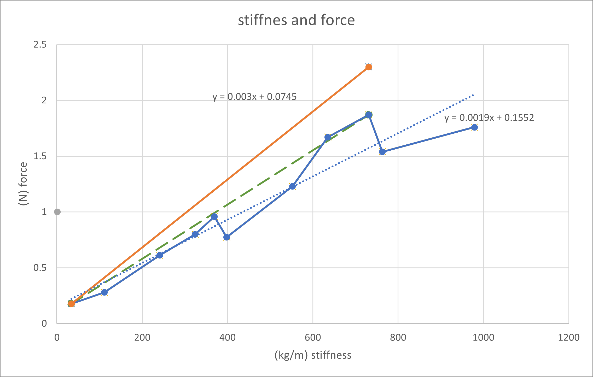

# two finger robotic gripper
# Abstract
This project focused on designing and building a robotic gripper capable of grasping and holding objects up to 70 grams and 5 cm in diameter. A rack and pinion mechanism with a servo motor was used for gripper movement, and a force sensor (FSR) was calibrated to establish the relationship between force and sensor output. A moving average filter was implemented to reduce sensor fluctuations. Object stiffness was measured, and the required grasping force was estimated using linear regression. A P controller was chosen over PID for simplicity and efficiency. Finally, the gripper successfully held various objects, such as paper cups, eggs, and foosball balls, with appropriate force.

# 3D Model 

# FSR Calibration 
In this test, by providing real-world conditions for the sensor and connecting it to the gripper with objects of varying weights, we determined the relationship between the output and the actual value. We also tested this for different series resistances to use the best and most accurate series resistance.

 # stiffness detection
 One of the challenges we faced in the project was determining the appropriate force to hold various objects with different masses and stiffnesses. Inspired by an article that assigned specific forces to each stiffness range, we designed a method to obtain the stiffness of objects. By calculating the difference in force and the difference in displacement, the gripper first determines the stiffness coefficient of different objects and then estimates the appropriate force to hold the object.
 

 # controll method
 
